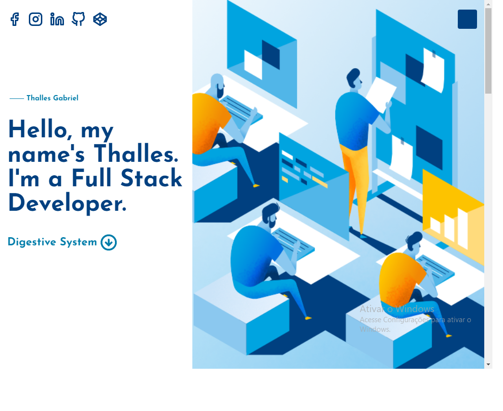
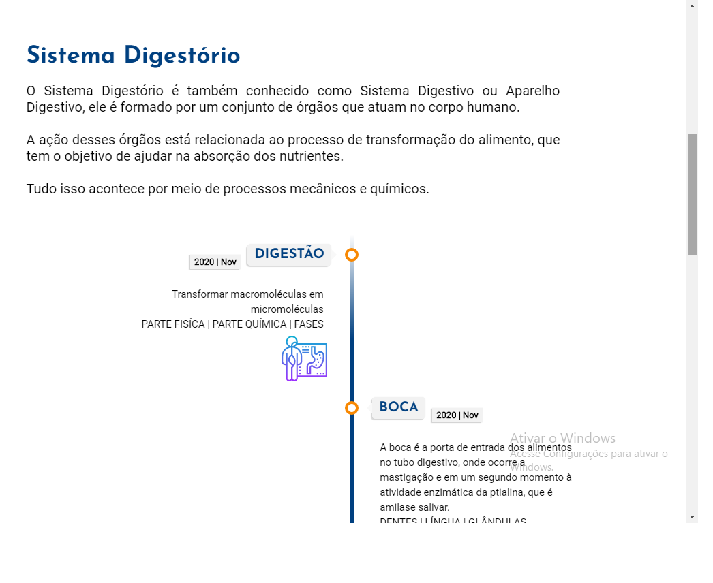
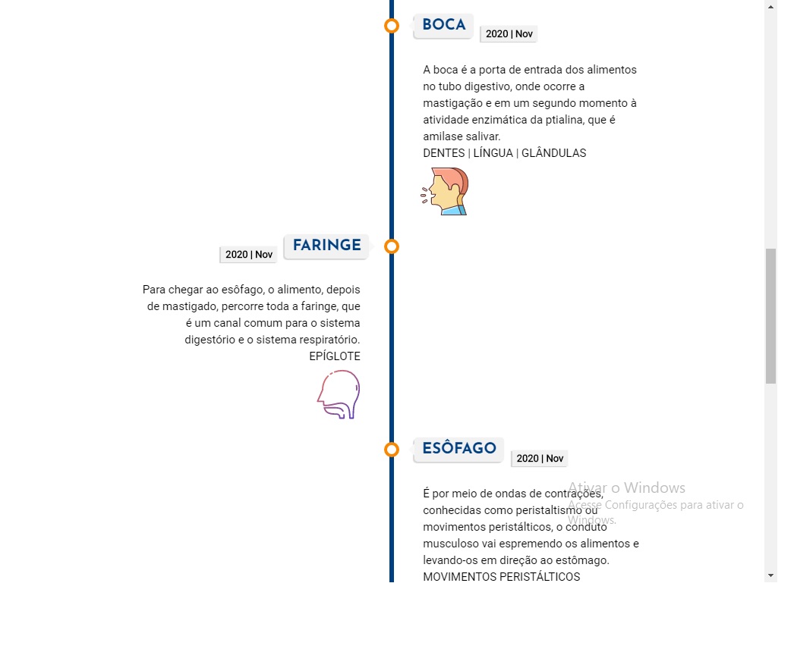

<h1 align="center">✏ Desenvolvido para um trabalho da matéria de Biologia.<h1>

<h2>💻 Tecnologias utilizadas:<h2>

  - HTML5
  - CSS3
  - JavaScript
  
<h2>🔥 Um pouco sobre a aplicação:</h2>

<h2>📱 Minhas redes sociais:</h2>

   
    
      
  
    
    
   
  
  
 

<h4>Feito com ❤ por Thalles Gabriel 🔥 
